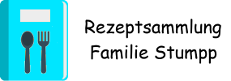

# Recipe Collector

The recipe collector is a collection blog for cooking recipes for my family. It is based on the [Eleventy](https://11ty.io) template ["My Online Cookbook"](https://github.com/maeligg/my-online-cookbook) by @maeligg. I translated the whole thing into German, adapted the colours and made a few minimal changes in the templates.

## Changes:
  * added variable sourceCaption(site.json)
  * uses variable sourceCaption|default("Quelle") as label (recipe.njk)
  * removed *authorintitle* from home page 
  * changed primary color from **#ffdb70** to **#70dbff**
  * changed secondary color from **#32816e** to **#32816e**
  * Initial deploy to [Netlify] (https://app.netlify.com/start/deploy?repository=https://github.com/m-e-st/recipe-collector&stack=cms)

    
## Information from the creator.

"My Online Cookbook" is a starter kit to create your own website of recipes, using [Eleventy](https://11ty.io) and [Netlify CMS](https://www.netlifycms.org/). It is meant to be both highly accessible (including to non-developers), as well as fully customisable should you want to use it as a starting off point.

Original README doc : <https://github.com/maeligg/my-online-cookbook#readme>
Set-up instructions : <https://myonlinecookbook.xyz/>
